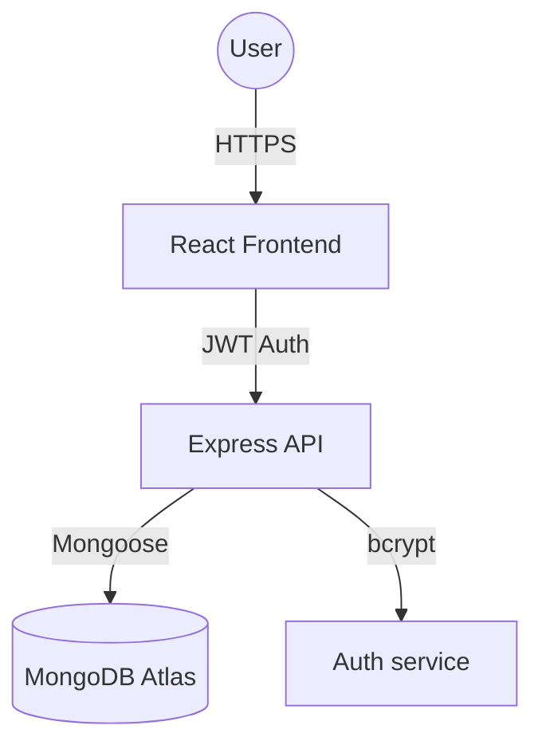

# Architecture Overview: HabitStack

HabitStack is built on a modern MERN-like stack, optimized for developer experience and scalability. This document outlines the core system design and data flow.

## 🏗 System Architecture

The application is split into two main components:
1.  **Client**: A Vite-powered React application using Tailwind CSS for UI and Recharts for data visualization.
2.  **Server**: A Node.js/Express REST API that handles business logic, authentication, and database interactions.

### Component Diagram



## 📂 Directory Structure

```text
habitstack/
├── client/                 # React Frontend
│   ├── src/
│   │   ├── components/    # Reusable UI components
│   │   ├── context/       # Auth and state management
│   │   ├── pages/         # View components
│   │   └── services/      # API abstraction
│   └── tailwind.config.js # Design system tokens
└── server/                # Node.js Backend
    ├── models/            # Mongoose schemas
    ├── routes/            # Express routes
    ├── controllers/       # Business logic handlers
    ├── middleware/        # Auth & validation
    └── utils/             # Database connection & helpers
```

## 🔐 Security Model

-   **Authentication**: Stateless JWT-based authentication.
-   **Password Hashing**: Bcrypt with a salt factor of 10.
-   **Security Headers**: Helmet.js middleware for base security.
-   **CORS**: Configured for specific origin access.

## 📈 Data Flow

1.  **Check-in**: User clicks check-in → Frontend sends `POST` request with JWT → Server verifies user → Server checks for daily duplicates → Server updates `Habit` streak and grants `User` points → Returns updated object.
2.  **Dashboard**: Frontend loads → Fetches `/api/stats` → Server aggregates check-in history → Returns chart-ready JSON.
